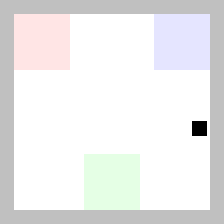
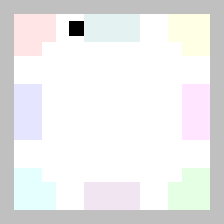

## Description

A 2D grid-based navigation task where an agent must navigate to a target colored pad within a structured layout. The environment features multiple colored pads arranged in various configurations, with walls constraining movement. The agent receives a visual observation showing the current state and a goal image showing the target configuration.

The task requires the agent to:
1. Identify the target colored pad from the goal image
2. Navigate through open spaces
3. Reach the target pad (either by stepping on it or being fully within its boundaries)

**Success criteria**: The episode is successful when the agent reaches the target pad. In the continuous version (`PinPad`), the agent must have all four of its corners within the target pad, meaning that it is entirely contained in the target pad. In the discrete version (`PinPadDiscrete`), the agent succeeds by simply stepping onto the target pad, because its position is grid-aligned.

```python
import stable_worldmodel as swm

# Continuous action space version
world = swm.World('swm/PinPad-v0', num_envs=4, image_shape=(224, 224))

# Discrete action space version
world = swm.World('swm/PinPadDiscrete-v0', num_envs=4, image_shape=(224, 224))
```

## Environment Specs

### Continuous Action Space (`PinPad-v0`)

| Property | Value |
|----------|-------|
| Action Space | `Box(-1, 1, shape=(2,))` — 2D continuous movement (dx, dy) |
| Observation Space | `Dict(image=(224, 224, 3), agent_position=(2,))` |
| Reward | 10 for reaching target, 0 otherwise |
| Episode Length | 100 steps (default) |
| Render Size | 224×224 (16×16 grid at 14× scale) |
| Grid Size | 16×16 cells |

#### Action Details

Actions are 2D vectors (dx, dy) clipped to [-1, 1] that move the agent continuously. The agent's center position is constrained so that it cannot move through walls (#).

#### Observation Details

| Key | Shape | Description |
|-----|-------|-------------|
| `image` | `(224, 224, 3)` | RGB rendering of the current state |
| `agent_position` | `(2,)` | Agent position (x, y) as floats in [1.5, 14.5] |

#### Info Dictionary

The `info` dict returned by `step()` and `reset()` contains:

| Key | Description |
|-----|-------------|
| `goal` | Goal image (224, 224, 3) showing the target pad highlighted with the agent on it|
| `goal_position` | Position (x, y) of the farthest cell in target pad from center |

### Discrete Action Space (`PinPadDiscrete-v0`)

| Property | Value |
|----------|-------|
| Action Space | `Discrete(5)` — {no-op, up, down, right, left} |
| Observation Space | `Dict(image=(224, 224, 3), agent_position=(2,))` |
| Reward | 10 for reaching target, 0 otherwise |
| Episode Length | 100 steps (default) |
| Render Size | 224×224 (16×16 grid at 14× scale) |
| Grid Size | 16×16 cells |

#### Action Details

Actions are discrete movements:
- `0`: No-op (stay in place)
- `1`: Move up (dy = +1)
- `2`: Move down (dy = -1)
- `3`: Move right (dx = +1)
- `4`: Move left (dx = -1)

The agent cannot move through walls (#). Movement is grid-aligned with integer positions.

#### Observation Details

| Key | Shape | Description |
|-----|-------|-------------|
| `image` | `(224, 224, 3)` | RGB rendering of the current state |
| `agent_position` | `(2,)` | Agent position (x, y) as integers in [0, 15] |

#### Info Dictionary

The `info` dict returned by `step()` and `reset()` contains:

| Key | Description |
|-----|-------------|
| `goal` | Goal image (224, 224, 3) showing the target pad highlighted with the agent on it|
| `goal_position` | Grid position (x, y) of the farthest cell in target pad from center |

## Variation Space



The environment supports customization through the variation space:

| Factor | Type | Description |
|--------|------|-------------|
| `agent.spawn` | Box([1.5, 1.5], [14.5, 14.5]) (continuous) or Discrete(196) (discrete) | Agent starting position |
| `agent.target_pad` | Box(0.0, 1.0) | Target pad selection (linearly mapped to available pads) |
| `grid.task` | Discrete(6) | Task layout: 'three', 'four', 'five', 'six', 'seven', 'eight' |

### Task Layouts

The environment includes 6 predefined layouts with different numbers of colored pads:

| Task Name | Number of Pads | Description |
|-----------|----------------|-------------|
| `three` | 3 pads | Pads 1, 2, 3 arranged in T-shape |
| `four` | 4 pads | Pads 1, 2, 3, 4 in corners |
| `five` | 5 pads | Pads 1-5 with more complex layout |
| `six` | 6 pads | Pads 1-6 arranged on left and right sides |
| `seven` | 7 pads | Pads 1-7 with central pad |
| `eight` | 8 pads | Pads 1-8, placed on sides and corners |

### Default Variations

By default, these factors are randomized at each reset:
- `agent.spawn` — Starting position
- `agent.target_pad` — Which pad is the goal

The task layout (`grid.task`) defaults to 'three' but can be randomized:

```python
# Randomize task layout
world.reset(options={'variation': ['grid.task']})

# Randomize everything
world.reset(options={'variation': ['all']})

# Fix a specific task
world.reset(options={
    'variation': ['grid.task'],
    'variation_values': {'grid.task': 5}  # Use 'eight' layout
})
```

### Pad Colors

Each numbered pad has a distinct color:

| Pad | Color (RGB) |
|-----|-------------|
| 1 | Red (255, 0, 0) |
| 2 | Green (0, 255, 0) |
| 3 | Blue (0, 0, 255) |
| 4 | Yellow (255, 255, 0) |
| 5 | Magenta (255, 0, 255) |
| 6 | Cyan (0, 255, 255) |
| 7 | Purple (128, 0, 128) |
| 8 | Teal (0, 128, 128) |

Pads are dimmed (10% color + 90% white) when not occupied, and fully colored when the agent is on them.

## Expert Policy

The environment includes built-in expert policies for both continuous and discrete action spaces. These policies use optimal navigation to reach the target pad efficiently.

### Continuous Action Space

```python
from stable_worldmodel.envs.pinpad import ExpertPolicy

policy = ExpertPolicy(max_norm=1.0, add_noise=True)
world.set_policy(policy)
```

#### ExpertPolicy Parameters

| Parameter | Type | Default | Description |
|-----------|------|---------|-------------|
| `max_norm` | float | 1.0 | Maximum action magnitude. Actions are clipped to this L2 norm. |
| `add_noise` | bool | True | Whether to add Gaussian noise (σ=1.0) to actions before clipping. Useful for generating diverse trajectories. |

The expert policy computes the vector from the agent's current position to the goal position, optionally adds noise, and clips the action to the maximum norm.

### Discrete Action Space

```python
from stable_worldmodel.envs.pinpad import ExpertPolicyDiscrete

policy = ExpertPolicyDiscrete()
world.set_policy(policy)
```

The discrete expert policy uses Manhattan distance to determine the optimal action. When both horizontal and vertical movement are needed, it alternates between them.

### Usage with Vectorized Environments

Both expert policies work seamlessly with vectorized environments:

```python
import stable_worldmodel as swm
from stable_worldmodel.envs.pinpad import ExpertPolicy

# Continuous version
world = swm.World('swm/PinPad-v0', num_envs=10, image_shape=(224, 224))
policy = ExpertPolicy(max_norm=0.8, add_noise=True)
world.set_policy(policy)

# Collect data with random task variations
world.record_dataset(
    dataset_name='pinpad_expert',
    episodes=1000,
    seed=42,
    options={'variation': ['agent.spawn', 'agent.target_pad', 'grid.task']}
)
```

```python
# Discrete version
world = swm.World('swm/PinPadDiscrete-v0', num_envs=10, image_shape=(224, 224))
policy = ExpertPolicyDiscrete()
world.set_policy(policy)

world.record_dataset(
    dataset_name='pinpad_discrete_expert',
    episodes=1000,
    seed=42
)
```
