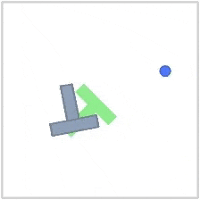
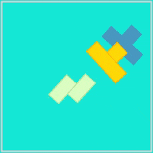

## Description

A 2D contact-rich manipulation task where an agent controls a circular end-effector to push a T-shaped block into a target pose. The environment uses [Pymunk](http://www.pymunk.org/) physics simulation with realistic friction and collision dynamics.

The agent must push the block to match both the target **position** and **orientation**, making this a challenging task that requires planning multi-step pushing sequences rather than simple point-to-point control.

**Success criteria**: The episode is successful when the block position error is less than 20 pixels AND the orientation error is less than π/9 radians (~20°) than the target configuration.

```python
import stable_worldmodel as swm
world = swm.World('swm/PushT-v1', num_envs=4, image_shape=(128, 128))
```

## Environment Specs

| Property | Value |
|----------|-------|
| Action Space | `Box(-1, 1, shape=(2,))` — 2D relative velocity control |
| Observation Space | `Dict(proprio=(4,), state=(7,))` |
| Reward | Negative distance to goal state (higher is better) |
| Episode Length | 200 steps (default) |
| Render Size | 224×224 (configurable) |
| Physics | Pymunk, 10 Hz control, PD controller |

### Observation Details

| Key | Shape | Description |
|-----|-------|-------------|
| `proprio` | `(4,)` | Agent position (x, y) and velocity (vx, vy) |
| `state` | `(7,)` | Full state: agent pos (2), block pos (2), block angle (1), agent vel (2) |

### Info Dictionary

The `info` dict returned by `step()` and `reset()` contains:

| Key | Description |
|-----|-------------|
| `goal` | Goal image (H, W, 3) |
| `goal_state` | Goal state vector (7,) |
| `goal_proprio` | Goal proprioception (4,) |
| `pos_agent` | Current agent position |
| `vel_agent` | Current agent velocity |
| `block_pose` | Block position and angle (3,) |
| `n_contacts` | Number of contact points this step |

## Variation Space





The environment supports extensive customization through the variation space:

| Factor | Type | Description |
|--------|------|-------------|
| `agent.color` | RGBBox | Agent color (default: RoyalBlue) |
| `agent.scale` | Box(20, 60) | Agent size |
| `agent.shape` | Discrete(8) | Shape index (default: circle) |
| `agent.angle` | Box(-2π, 2π) | Initial rotation |
| `agent.start_position` | Box([50, 50], [450, 450]) | Starting position |
| `agent.velocity` | Box([0, 0], [512, 512]) | Initial velocity |
| `block.color` | RGBBox | Block color (default: LightSlateGray) |
| `block.scale` | Box(20, 60) | Block size |
| `block.shape` | Discrete(7) | Shape: L, T, Z, square, I, small_tee, + |
| `block.angle` | Box(-2π, 2π) | Initial rotation |
| `block.start_position` | Box([100, 100], [400, 400]) | Starting position |
| `goal.color` | RGBBox | Goal overlay color (default: LightGreen) |
| `goal.scale` | Box(20, 60) | Goal size |
| `goal.angle` | Box(-2π, 2π) | Target rotation |
| `goal.position` | Box([50, 50], [450, 450]) | Target position |
| `background.color` | RGBBox | Background color (default: white) |

### Default Variations

By default, only these factors are randomized at each reset:

- `agent.start_position`
- `block.start_position`
- `block.angle`

To randomize additional factors, pass them via the `variation` option:

```python
# Randomize colors for domain randomization
world.reset(options={'variation': ['agent.color', 'block.color', 'background.color']})

# Randomize everything
world.reset(options={'variation': ['all']})
```

## Datasets

| Name | Episodes | Policy | Download |
|------|----------|--------|----------|
| `pusht_expert` | 1000 | Weak Expert | — |

## Expert Policy

This environment includes a built-in weak expert policy for data collection. The `WeakPolicy` generates actions that keep the agent near the block, increasing the probability of meaningful interactions during data collection.

```python
from stable_worldmodel.envs.pusht import WeakPolicy

policy = WeakPolicy(dist_constraint=100)
world.set_policy(policy)
```

### WeakPolicy Parameters

| Parameter | Type | Default | Description |
|-----------|------|---------|-------------|
| `dist_constraint` | int | 100 | Pixel distance constraint around the block for sampling actions. Actions are clipped to keep the agent within this distance of the block center. |

### Usage with Vectorized Environments

The `WeakPolicy` works seamlessly with both single and vectorized environments. When used with vectorized environments (like those created by `World`), it automatically detects the environment spec from sub-environments:

```python
import stable_worldmodel as swm
from stable_worldmodel.envs.pusht import WeakPolicy

# Works with vectorized environments
world = swm.World('swm/PushT-v1', num_envs=4, image_shape=(64, 64))
policy = WeakPolicy(dist_constraint=50)  # Tighter constraint for more interactions
world.set_policy(policy)

# Collect data
world.record_dataset(
    dataset_name='pusht_weak_expert',
    episodes=100,
    seed=42
)
```

### Discrete Action Space

The policy automatically detects and handles discrete action spaces when using `swm/PushTDiscrete-v*` environments:

```python
world = swm.World('swm/PushTDiscrete-v1', num_envs=4, image_shape=(64, 64))
policy = WeakPolicy()  # Automatically uses quantized actions
world.set_policy(policy)
```
